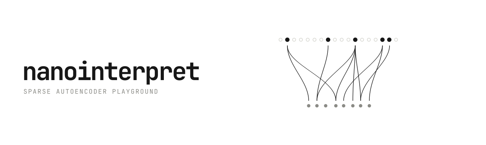
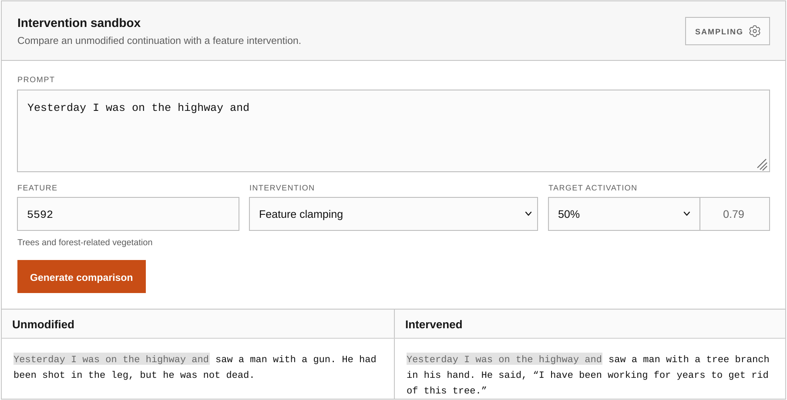

Nanointerpret objective is being the most minimal but full-fledged interpretability playground where you can:
- Train your own SAE on your own LLM
- Automatically interpret SAE features with a local or remote LLM
- Explore the features via a web GUI
- Forcefully activate features and observe the effect on LLM generations (the fun part)

If you want to try it right now, go to [nanointerpret.pages.dev](https://nanointerpret.pages.dev/)




## How to run

Prepare the environment:

```sh
python3 -m venv .venv
source .venv/bin/activate
pip install -r requirements.txt
```

Then proceed to a guide:

- [Gemma3 270M Base](docs/training-guides/gemma.md) (~6GB free RAM required)
- [Qwen3 1.7B Base](docs/training-guides/qwen.md) (~13GB free RAM required)

For low RAM devices: try to lower `--model-batch-size` or `--sae-batch-size`.

## Details

The repo takes different ideas from [OpenAI](https://arxiv.org/abs/2406.04093) and [Anthropic](https://transformer-circuits.pub/2024/scaling-monosemanticity/index.html). It also includes some ablation experiments I did to see what works best ([experiments.md](docs/experiments.md))

Future objectives:
- [ ] Use llama.cpp to run LLM and capture acivations
- [ ] Test on 3B-7B models
- [ ] Test on interactive chat tuned models (the repo uses pretrained base Gemma/Qwen)

> [!NOTE]
> This should not be taken as a reference implementation. I made this project just to get started with an hands-on approach and share the results publicly.
