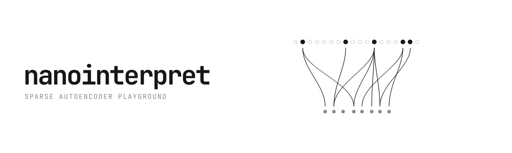

Nanointerpret objective is being a minimal but full-fledged interpretability playground where you can:
- Train your own [SAE](https://www.lesswrong.com/posts/8YnHuN55XJTDwGPMr/a-gentle-introduction-to-sparse-autoencoders) on your own LLM
- Record SAE feature activations

To train your SAE locally, check [Train your SAE](#train-your-sae) below.

Want to know more about the decisions that went into making this project? Check [experiments.md](docs/experiments.md).

## Train your SAE

1. Prepare the environment:

```sh
python3 -m venv .venv
source .venv/bin/activate
pip install -r requirements.txt
```

2. Then proceed to a guide:

- [Gemma3 270M Base](docs/training-guides/gemma.md) (~5GB free RAM required)
- [Qwen3 1.7B Base](docs/training-guides/qwen.md) (~14GB free RAM required)

## Details

The repo takes different ideas from [OpenAI](https://arxiv.org/abs/2406.04093) and [Anthropic](https://transformer-circuits.pub/2024/scaling-monosemanticity/index.html). It also includes various ablation experiments I did to see what works best ([experiments.md](docs/experiments.md))

Future objectives:
- [ ] Use later layers to avoid heavily syntactic features
- [ ] Use llama.cpp to run LLM and capture acivations
- [ ] Test on 3B-7B models
- [ ] Test on interactive chat tuned models (the repo uses pretrained base Gemma/Qwen)

> [!NOTE]
> This should not be taken as a reference implementation. I made this project just to get started with an hands-on approach and share the results publicly.
