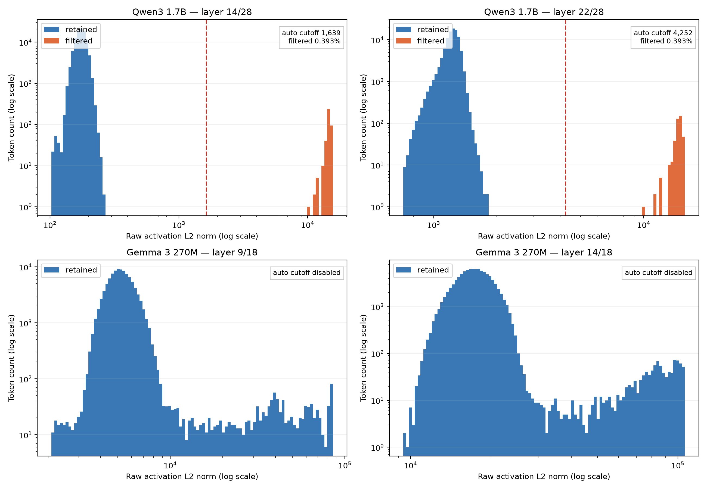

# Experiments

## Lessons learned

- Lowering `K` from `32` to `16` improves interpretability (but costs reconstruction accuracy). Increasing SAE width from `16x` to `32x` sometimes separates fused concepts better, but needs more data and (in Gemma 270M) doesn't fix its poor text understanding due to its tiny size. It also significantly increases duplicate features.
- A later-layer Gemma run produced more abstract features, but they became incoherent already at medium activation levels. It's important to check the whole activation distribution.
- Local models are quite good at interpreting features. Gemma 4 26B MoE interpretations were comparable to (or even better than) GPT 5.6 Terra, making local interpretation very practical and much cheaper if you can wait for longer (see [here](experiments.md#finding-the-best-model-for-interpreting-features-locally)).
- FineWeb-Edu was a poor choice, features seemed to encode the dataset's educational style. For example, an apparently general fire-related feature steered the model toward educational fire-themed completions. This is evident for many features in both Gemma3 270M and Qwen3 1.7B.

Hardware: M4 Max Mac Studio (CPU 16C, GPU 40C, 64GB RAM)

## MPS streaming performance
On Apple Silicon compiling each LLM layer improves its throughput by ~100% for Gemma3 270M, ~50% for Qwen3 0.6B, ~8% for Qwen3 1.7B.

<details>
<summary>Command</summary>

```sh
python train.py --model-id unsloth/Qwen3-0.6B-Base --activation-layer 14 --train-tokens 1000000 --validation-tokens 100000 --normalization-tokens 100000 --dead-window 100000 --model-batch-size 32 --sae-batch-size 4096 --width-multiplier 16 --k 16
python train.py --model-id unsloth/Qwen3-0.6B-Base --activation-layer 14 --train-tokens 1000000 --validation-tokens 100000 --normalization-tokens 100000 --dead-window 100000 --model-batch-size 32 --sae-batch-size 4096 --width-multiplier 16 --k 16 --no-compile-model
python train.py --model-id unsloth/Qwen3-1.7B-Base --activation-layer 14 --train-tokens 1000000 --validation-tokens 100000 --normalization-tokens 100000 --dead-window 100000 --model-batch-size 32 --sae-batch-size 4096 --width-multiplier 16 --k 16
python train.py --model-id unsloth/Qwen3-1.7B-Base --activation-layer 14 --train-tokens 1000000 --validation-tokens 100000 --normalization-tokens 100000 --dead-window 100000 --model-batch-size 32 --sae-batch-size 4096 --width-multiplier 16 --k 16 --no-compile-model
```

</details>

| Model | Prefix compilation | Activation capture | SAE training | Streamed training |
|---|:---:|---:|---:|---:|
| Qwen3-0.6B, layer 14 | ✗ | 18.35k tok/s | 35.47k tok/s | 12.12k tok/s |
| Qwen3-0.6B, layer 14 | ✓ | **28.54k tok/s** | 35.22k tok/s | **15.89k tok/s (+31%)** |
| Qwen3-1.7B, layer 14 | ✗ | 7.89k tok/s | 17.41k tok/s | 5.41k tok/s |
| Qwen3-1.7B, layer 14 | ✓ | **9.70k tok/s** | 17.39k tok/s | **6.18k tok/s (+14%)** |

## Pre-bias subtraction and AuxK

Pre-bias subtraction and AuxK were both useful for training SAEs.

<details>
<summary>Commands</summary>

```sh
python3 train.py --cache-activations --train-tokens 300000000 --checkpoint-every 150000000 --output-dir artifacts/300M_aux_sub
python3 train.py --cache-activations --train-tokens 300000000 --checkpoint-every 150000000 --output-dir artifacts/300M_sub --aux-k-coef 0
python3 train.py --cache-activations --train-tokens 300000000 --checkpoint-every 150000000 --output-dir artifacts/300M_aux --no-subtract-pre-bias
python3 train.py --cache-activations --train-tokens 300000000 --checkpoint-every 150000000 --output-dir artifacts/300M_plain --no-subtract-pre-bias --aux-k-coef 0
```

</details>

| Pre-bias subtraction | AuxK | Validation MSE | Explained variance | Dead features |
|:---:|:---:|---:|---:|---:|
| ✓ | ✓ | **0.002327** | **99.444%** | **0.107%** |
| ✓ | ✗ | 0.002485 | 99.407% | 23.779% |
| ✗ | ✓ | 0.002549 | 99.391% | 21.270% |
| ✗ | ✗ | 0.004399 | 98.949% | 94.570% |

## Gradient clipping is unnecessary

Disabling gradient clipping slightly improved validation metrics and increased training throughput by ~40%.

<details>
<summary>Commands</summary>

```sh
python3 train.py --cache-activations --train-tokens 300000000 --checkpoint-every 150000000 --output-dir artifacts/300M_aux_sub
python3 train.py --cache-activations --train-tokens 300000000 --checkpoint-every 150000000 --output-dir artifacts/300M_aux_sub_clip --gradient-clip 1
```

</details>

| Gradient clipping | Validation MSE | Explained variance | Dead features | Training throughput |
|:---:|---:|---:|---:|---:|
| ✓ (1) | 0.002335 | 99.442% | 0.127% | 65k tokens/s |
| ✗ | **0.002327** | **99.444%** | **0.107%** | **91k tokens/s (+40%)** |

## Fixing Qwen first-token activation outliers

Qwen tends to have extremely large residual-stream activations at the first sequence token ([paper](https://arxiv.org/pdf/2605.11887), bottom of page 2).

To prevent them from dominating SAE normalization / training, a raw L2-norm filter was added. Use `--max-activation-l2 auto` to detect the separated outlier cluster, or provide your numeric cutoff. Note that the cutoff is model and layer specific.



Gemma 3 270M also has very large residual-stream activations, however they occur over tokens like BOS and punctuation. So they are more complex and potentially meaningful, unlike Qwen's case. I would not recommend L2 filtering for Gemma by default but feel free to test it.

## Finding the best model for interpeting features locally

For interpreting features (interpret_features.py) `gemma-4-26b-a4b-it` was the best model available locally, beating even `openai/gpt-5.6-terra`. Obviously remote API models have virtually infinite parallelization and can be almost instant compared to using Gemma (around 2.2 features/s on an M4 Max mac Studio, so around 20h for 32k features).

| Model | Title similarity (to Sol) | Category agreement (to Sol) | Total time |
|---|---:|---:|---:|
| `gemma-4-26b-a4b` (unsloth Q4K_XL) | **0.76** | **71%** | 255 s |
| `qwen3.6-35b-a3b-mlx` (unsloth 4bit) | 0.73 | 60% | 176 s |
| `gpt-5.6-terra` (openrouter) | 0.73 | 56% | - |
| `gpt-5.6-luna` (openrouter) | 0.72 | 54% | - |
| `gemma-4-e4b` (unsloth Q4K_XL) | 0.70 | 63% | 183 s |
| `gemma-4-e2b` (unsloth Q4K_XL) | 0.67 | 44% | 89 s |

The models interpreted feature IDs 0-99 from
`qwen3_1.7b_l14_w16_k16_500m`. The reference ground truth interpretations are from
`openai/gpt-5.6-sol`.
