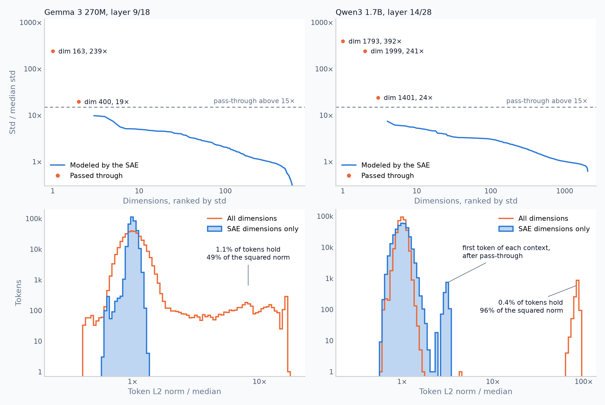
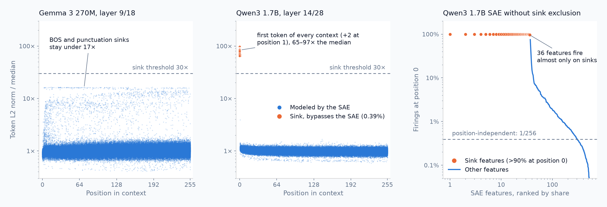

# Experiments

Hardware: M4 Max Mac Studio (CPU 16C, GPU 40C, 64GB RAM)

## Lessons learned

- Compare runs on downstream KL: MSE and explained variance change meaning with pass-through dims and sink exclusion.
- Lowering `K` from 32 to 16 improves interpretability at some reconstruction cost. Widening the SAE from 16x to 32x sometimes separates fused concepts, but needs more data, adds many duplicate features, and doesn't fix Gemma 270M's poor text understanding.
- A later-layer Gemma run gave more abstract features that turned incoherent already at medium activations: check the whole activation distribution, not just the top.
- FineWeb-Edu was a poor dataset: features picked up its educational style (a fire feature steered completions toward educational fire content), in both Gemma 3 270M and Qwen3 1.7B.

## Ablations

Runs train on 100M FineWeb tokens and validate on 10M held-out ones, with downstream KL on 1M of them (95% CIs are about ±0.005 for Gemma and ±0.002 for Qwen). Each row adds its flags to the base command.

<details>
<summary>Base commands</summary>

```sh
python3 train.py --model-id unsloth/gemma-3-270m --activation-layer 9 --k 16 --train-tokens 100000000 --validation-tokens 10000000 --recording-tokens 0 --validate-every 100000000 --cache-activations
python3 train.py --model-id unsloth/Qwen3-1.7B-Base --activation-layer 14 --train-tokens 100000000 --validation-tokens 10000000 --recording-tokens 0 --validate-every 100000000
```

</details>

Gemma 3 270M, layer 9, `k=16`:

| Run | Flags | Dead features | Downstream KL | Throughput |
|---|---|---:|---:|---:|
| Default | | 0.5% | 0.561 | 122k tok/s |
| No AuxK | `--aux-k-coef 0` | 9.5% | 0.573 | 126k tok/s |
| No pre-bias subtraction | `--no-subtract-pre-bias` | 6.0% | 0.599 | 130k tok/s |
| Neither | `--aux-k-coef 0 --no-subtract-pre-bias` | 79.8% | 0.899 | 142k tok/s |
| Gradient clipping | `--gradient-clip 1` | 0.5% | 0.557 | 79k tok/s |
| No pass-through dims | `--no-passthrough-massive-dims` | 2.0% | 0.683 | 120k tok/s |

- Pre-bias subtraction and AuxK both matter, and dropping both is far worse than dropping either.
- Gradient clipping makes no difference within the KL's confidence interval but slows training by 35%, so it's off by default.
- Passing [massive dimensions](#massive-activations) through lowers KL by 18%.

Qwen3 1.7B, layer 14, `k=32`:

| Run | Flags | Pass-through dims | Dead features | Downstream KL |
|---|---|---|---:|---:|
| Default | | none | 9.7% | 0.148 |
| No sink exclusion | `--no-exclude-sinks` | 1401, 1793, 1999 | 12.3% | 0.148 |

- Excluding [sink tokens](#massive-activations) leaves KL unchanged but lowers dead features, and frees the 36 features that otherwise fire almost only at position 0.

## Massive activations

A few residual dimensions carry extremely large activations that mark attention sinks. They hold little information but dominate SAE normalization and inflate explained variance (in Gemma 3 270M one dimension holds 96% of the variance). Two automatic fixes, both on by default, keep them out of the SAE; the bypassed values are fed back to the model unchanged.

- **Sink tokens** (`--no-exclude-sinks` to disable): tokens whose residual norm exceeds 30x the median token's. In Qwen, 0.39% of tokens: the first token of every context ([paper](https://arxiv.org/pdf/2605.11887), bottom of page 2; Qwen has no BOS) and rarely one at position 1-2. Their norm is 65-97x the median, while every other token stays under 4x. Gemma has none: its BOS and punctuation sinks stay under 17x.
- **Pass-through dims** (`--no-passthrough-massive-dims` to disable): dimensions whose std over non-sink tokens exceeds 15x the median dimension's. Gemma gets 163 and 400. Qwen gets none, as its massive dimensions only spike on sink tokens.





## Performance

- On MPS, compiling the layers before the capture point speeds up activation capture by ~2x for Gemma 3 270M, ~1.5x for Qwen3 0.6B, and ~1.2x for Qwen3 1.7B.
- With the defaults, Gemma 3 270M trains at ~122k tok/s on cached residuals and Qwen3 1.7B at ~6.3k tok/s streamed; both are GPU-bound.
